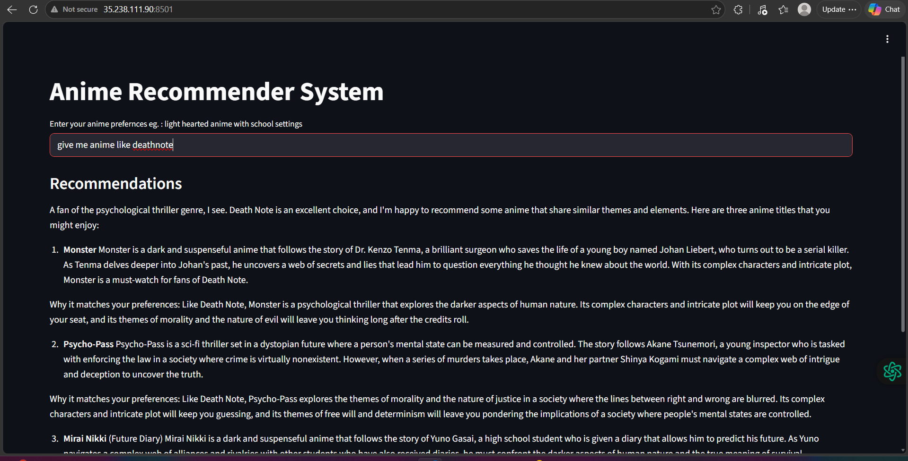
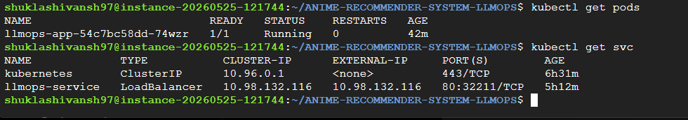
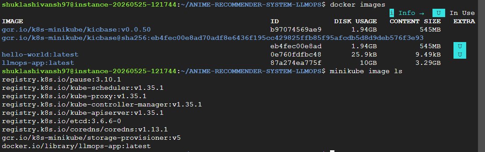

# 🎌 Anime Recommender System (LLMOps + Kubernetes)

An AI-powered Anime Recommendation System that uses semantic search, embeddings, and LLM-powered retrieval to recommend anime from natural language prompts.

This project was containerized using Docker and deployed on Kubernetes (Minikube) running inside a Google Cloud Ubuntu VM.

---

# 🚀 Live Demo

Users can enter prompts like:

```text
give me anime like deathnote
```

and receive intelligent recommendations generated through vector search + LLM retrieval.

---

# 📸 Application Demo



Example query:

```text
give me anime like deathnote
```

Returned recommendations:

- Monster
- Psycho-Pass
- Mirai Nikki

---

# ✨ Features

- Natural language anime recommendations
- Semantic similarity search
- Chroma vector database
- Sentence Transformer embeddings
- LangChain retrieval pipeline
- Streamlit frontend
- Docker containerization
- Kubernetes deployment
- Google Cloud hosting

---

# 🛠 Tech Stack

### AI / ML

- LangChain
- Groq API
- Sentence Transformers
- ChromaDB

### Backend

- Python

### Frontend

- Streamlit

### DevOps / Deployment

- Docker
- Kubernetes
- Minikube
- Google Cloud Compute Engine
- Ubuntu

---

# 🧠 System Architecture

```text
User
   ↓
Streamlit Frontend
   ↓
LangChain Retrieval Pipeline
   ↓
Chroma Vector Store
   ↓
Anime Dataset Embeddings
   ↓
Docker Container
   ↓
Kubernetes (Minikube)
   ↓
Google Cloud VM
```

---

# ☁ Deployment Workflow

```text
Local Development
        ↓
GitHub
        ↓
Google Cloud VM (Ubuntu)
        ↓
Docker Build
        ↓
Docker Image
        ↓
Minikube Kubernetes Cluster
        ↓
Deployment + Service
        ↓
Public Streamlit App
```

---

# 🐳 Docker Containerization

Docker image created:

```text
llmops-app:latest
```

Docker packages:

- Python runtime
- dependencies
- source code
- Streamlit server
- vector database setup

Docker commands:

```bash
docker build -t llmops-app .
docker run -p 8501:8501 llmops-app
```

---

# ☸ Kubernetes Deployment

Deployment YAML used:

```yaml
replicas: 1

image: llmops-app:latest
```

Kubernetes automatically:

- manages containers
- restarts failures
- maintains availability
- handles networking

---

# Running Pods



Pod status:

```text
1/1 Running
```

Service:

```text
LoadBalancer
80:32211/TCP
```

---

# Docker + Minikube Images



Docker image successfully loaded into Minikube:

```text
docker.io/library/llmops-app:latest
```

---

# Run Locally

Clone repository:

```bash
git clone https://github.com/Shivansh-thecoder/ANIME-RECOMMENDER-SYSTEM-LLMOPS.git

cd ANIME-RECOMMENDER-SYSTEM-LLMOPS
```

Install dependencies:

```bash
pip install -r requirements.txt
```

Run app:

```bash
streamlit run app/app.py
```

---

# Docker Setup

Build:

```bash
docker build -t llmops-app .
```

Run:

```bash
docker run -p 8501:8501 llmops-app
```

---

# Kubernetes Setup

Apply deployment:

```bash
kubectl apply -f llmops-k8s.yaml
```

Check resources:

```bash
kubectl get pods

kubectl get svc
```

---

# Deployment Environment

Hosted on:

Google Cloud VM

Environment:

- Ubuntu Linux
- Docker
- Kubernetes
- Minikube
- Streamlit

---

# Challenges Faced During Deployment

Some issues encountered and solved:

- LangChain version conflicts
- protobuf dependency errors
- HuggingFace embedding compatibility
- Docker build failures
- Kubernetes ImagePullBackOff
- VM path configuration issues

---

# Author

Shivansh Shukla

Built as an LLMOps + Kubernetes deployment project while learning containerization, cloud deployment and DevOps.
